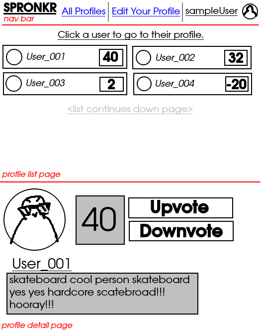
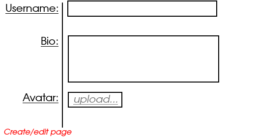

# Generic Social Media Site

_Generic social media site that allows users to make a profile, upvote/downvote others' profiles, and that's pretty much it. Maybe we'll come up with a name for it later, like SPRONKR. What a great name!_

## Wireframe

## here's the plan

0. readme/planning
1. Set up supabase tables
2. Make basic page layout with html/css
3. add test data to tables manually; write fetch/display functions, test
4. write functions/page JS for users to write bio/avatar/name/etc, test

## HTML elements (stuff present upon page load)
### (All pages)
    - nav bar with links to:
        - profiles list page
        - logged in user's profile page
        - edit user profile page
        - logout button

### Profiles list page
    - section for list of profiles, sorted by popularity: constant battle
        - each link to profile should display: username, avatar, popularity

### Profile detail page
    - section for: avatar, username, bio, popularity, upvote/downvote buttons

### Edit profile page
    - form allowing user to edit: username, avatar, bio
    - if user leaves field blank, do not change data

### Create profile page
    - same as profile page, without links to other pages at top

## State (everything you need to track internally using JS variables)

### (All pages)
    - object to hold username, avatar of logged in user

### Profile detail page
    - array to hold all profile data locally, to render to page

### Detail page
    - object to hold single profile data locally to render to page

## Events (anything that happens via JS when the user interacts with your site)

### All pages (nav bar)
    - links to: user's profile, edit profile page, logout

### Profile detail page
    - upvote/downvote buttons, on click:
        - increment/decrement user's popularity in DB, update on page

### Create/Edit Profile pages
    - on form submit: update info in DB

## Functions

### Render Functions
    - `renderProfileCard` - for profile list page
    - `renderProfileDetails` - for profile detail page
    - `renderPopularityEl(profile)` - given user profile object, renders upvote/downvote buttons w/event listeners and popularity display
    - `renderNavbarUserData` - rendering logged in user's avatar/username for top nav bar

### Display functions
    - `displayProfileList` - for profile list page
    - `displayProfileDetails` - for profile detail page
    - `displayNavbarUserData` - display logged in user's avatar/username at top nav bar

### Fetch Functions (if applicable)
    - `fetchProfile(id)` - fetch a single profile via id
    - `fetchAllProfiles()` - fetch all profiles
    - `upsertProfile(profile)` - updates/creates profile in supabase: if a field is left blank, do not update that column
    - `incrementPopularity(id)` - using id, increments profile popularity in DB
    - `decrementPopularity(id)` - same as above but decrement instead

### Other Functions
    - we'll see
